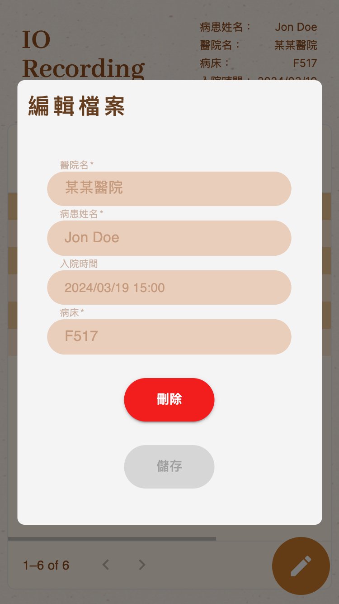

<h1 align='center' id="welcome">I/O Recording</h1>


> 病人的攝入與輸出(intake and output: I/O) 測量及記錄是監測心血管及腎功能重要的指標之一

這個專案是收集自身經驗設計，為了降低進行紀錄工作的負擔，提供 io 紀錄時相對便利的工具。

- 單筆紀錄快速建立
- 表格排序顯示
- 紀錄匯出 CSV 檔
- 可以建立多位患者檔案進行切換

## Menu

- [Welcome](#welcome)
- [操作說明](#how-to-use)
  - [1. 患者檔案新增、修改與刪除](#file-manage)
  - [2. io 紀錄新增與刪除](#record-manage)
  - [3. 表格排序與輸出](#display-export)
- [Running Locally](#running-locally)
- [資料夾說明](#資料夾說明)
- [使用技術](#使用技術)
- [聯絡方式](#聯絡方式)
<h2 align='center' id="how-to-use">操作說明<a href="#menu">🔝</a></h2>

- 使用上是否符合實際需求還請依自身情況進行評估，或是與醫護人員溝通了解為準。
- 使用者輸入的所有資訊都只會儲存在本地端(手機、平板、電腦...等) LocalStorage 中，不會發送給任何人作任何用途，請安心使用。
- 由於所有資料都儲存在 LocalStorage 中，使用期間請不要做任何 “清除瀏覽器資料” 的動作，以免紀錄遺失。

<h4 align='center' id="file-manage">1. 患者檔案新增、修改與刪除<a href="#menu">🔝</a></h4>

1. 第一次使用時可以直接填寫患者資料表格，送出就會套用該檔案並跳轉到資料頁。


2. 若已經存在患者檔案則會在首頁顯示列表提供點選。


3. 點擊紀錄頁面右上角顯示檔案資料的區塊，會顯示編輯檔案的視窗，也可以點擊刪除鈕刪除目前使用的檔案與其紀錄。



<h4 align='center' id="record-manage">2. io 紀錄新增與刪除<a href="#menu">🔝</a></h4>

1. 點擊紀錄頁面右下角的按鈕建立單筆紀錄。


2. 選擇紀錄的類型。


3. 填寫欄位：

- 日期欄位必填，會自動帶入當下的時間可以依需求自行調整。
- 計量欄位必填，除了“排便”目前不設有此欄位。單位為 ml 或 g，使用時根據提示填寫數字即可。
- 備註欄位非必填，可以用來記錄更詳細的內容，如食物種類、排尿排便狀態...等。


4. 送出後即會顯示在表格上，並且在單筆資料(row)的右方有垃圾桶按鈕，點擊按鈕就可以進行刪除。


<h4 align='center' id="display-export">3. 表格排序與輸出<a href="#menu">🔝</a></h4>

1. 點擊“欄位名稱”(column head)即可切換升降冪排序，常用於時間排序。
2. 表格上方提供三個按鈕：

- COLUMNS：可以在不影響目前紀錄的情況下，控制特定欄位顯示與否。
- FILTERS：可以在不影響目前紀錄的情況下，設定一個條件將資料篩選顯示，如篩選類別、篩選特定日期。
- EXPORT：可以輸出 csv 檔供使用者留存或進一步使用，輸出內容會受到 COLUMNS、FILTERS 的設定影響。( 檔名範例： io*record_export*{{西元年月日}}.csv、io_record_export_20240320.csv )


<h2 align='center' id="running-locally">Running Locally<a href="#menu">🔝</a></h2>

1. Clone this repository:

   ```bash
   git clone https://github.com/freshmeatba11/record_io_tool.git
   ```

2. Install the dependencies:

   ```bash
   npm install
   ```

3. Run the application:

   ```bash
   npm run dev
   # or
   yarn dev
   # or
   pnpm dev
   # or
   bun dev
   ```

4. Finally, visit [http://localhost:3000](http://localhost:3000/) in your web browser.

<h2 align='center' id="資料夾說明">資料夾說明<a href="#menu">🔝</a></h2>

- app - 頁面與專用元件放置處
- assets - 靜態資源放置處
- components - 通用元件放置處
- config - 固定常數資料放置處
- hooks - 客製 hooks 放置處
- lib - 套件 wrapper 放置處
- stores - zustand 狀態管理設定放置處
- theme - 共通樣式設定放置處

<h2 align='center' id="使用技術">使用技術<a href="#menu">🔝</a></h2>

- next: 14.0.4
- zustand: 4.4.7
- styled-components: 6.1.3
- dayjs: 1.11.10
- @mui/material: 5.15.2
- @mui/x-data-grid: 6.18.6

<h2 align='center' id="聯絡方式">聯絡方式<a href="#menu">🔝</a></h2>

email : cmjj8898212032@gmail.com
